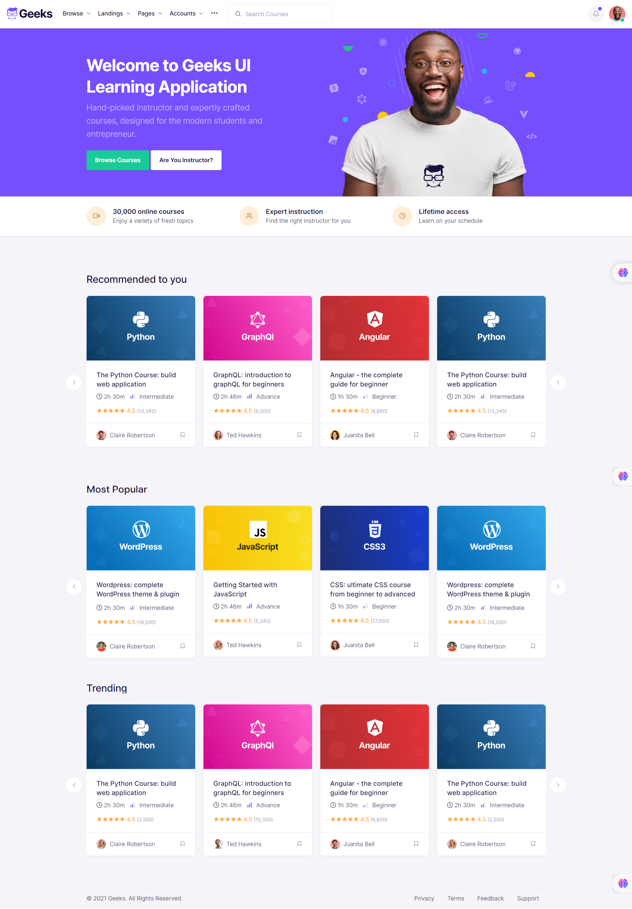
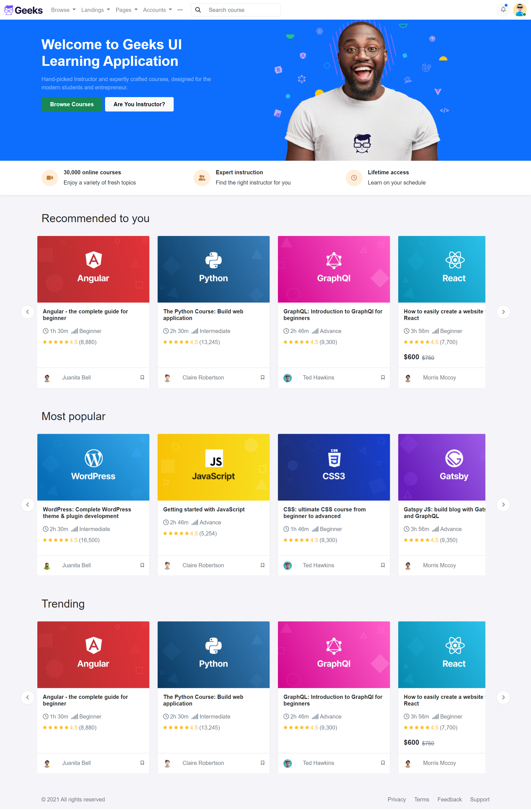

# Bootstrap Project - Clone landing page

## Description

This project is a clone of a landing page using Bootstrap. The project is a part of the Udemy course [The Ultimate Fullstack Web Development Bootcamp](https://www.udemy.com/course/the-ultimate-fullstack-web-development-bootcamp/?couponCode=JUST4U02223).

## Technologies

- HTML
- CSS
- Bootstrap

## Source

[here](https://codescandy.com/geeks/index.html)

## Implementation

[Live](https://asmaahamid02.github.io/langing-page-clone-bootstrap/)

